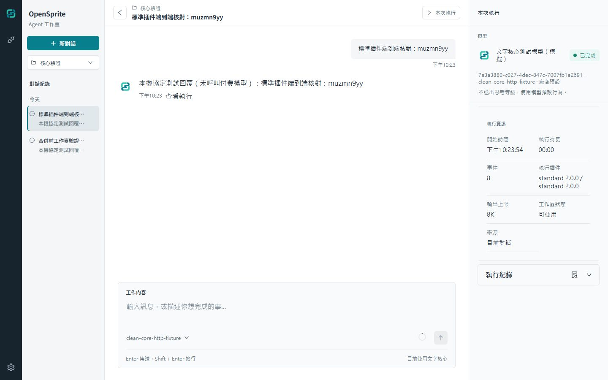
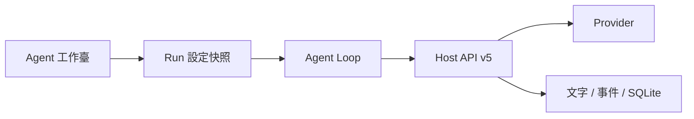

<div align="center">
  
  <h1>OpenSprite</h1>
  <p>本機 Agent 工作臺 · 文字核心 · 可替換的 Agent Loop</p>
  <p>
    <a href="#快速開始">快速開始</a> ·
    <a href="#使用工作臺">使用工作臺</a> ·
    <a href="#執行插件">執行插件</a> ·
    <a href="#開發與驗證">開發與驗證</a>
  </p>
</div>

OpenSprite 把模型連線、對話、執行紀錄與插件設定放在同一個工作臺。Loop 插件控制多輪推論、摘要、重試與續寫；Python Host 處理模型連線、限制、取消與持久化；React 介面透過同源 HTTP／SSE 顯示執行結果。

目前產品版本為 `0.21.35`。執行插件使用 **Host API v5**。



<sub>實際 Docker 介面；畫面中的模型為隔離測試 Provider，未呼叫付費模型。</sub>

## 目前提供

| 功能 | 行為 |
| --- | --- |
| 文字對話 | 串流或一次顯示回覆，保存 Conversation、Message 與 Run |
| 模型連線 | OpenAI、Anthropic、OpenRouter 與自訂 OpenAI-compatible Provider |
| 上下文管理 | Context／輸出預算、歷史摘要、符合設定的輸出續寫 |
| 執行控制 | 取消、完成／失敗狀態、歷史執行與診斷事件 |
| 執行插件 | 選擇 Agent Loop、匯入 wheel、下載部署包、核對安裝狀態 |
| 工作區 | 對話分組、受管理目錄與掛載中繼資料；文字核心不讀寫工作區檔案 |
| 本機設定 | 繁中／英文／日文、時區、鍵盤傳送偏好與存取模式 |

Tools、工具核准、Skills、Subagents、自訂 Agent 定義、MCP 與排程的執行實作已移除。記憶與外觀分類仍是停用的 Demo。完整邊界見 [乾淨核心設計](docs/architecture/clean-agent-core.md)。

## 快速開始

### Docker

需要 Docker Engine／Docker Desktop（Linux containers）與 Docker Compose v2。

```bash
git clone https://github.com/HsinPu/OpenSprite.git
cd OpenSprite
docker compose up -d --build --wait
```

開啟 **[http://localhost:8765/](http://localhost:8765/)**。更新原始碼後再次執行相同的 Compose 指令。

- 預設使用本機信任模式，只發布到主機 `127.0.0.1`。
- runtime 使用非 root 帳號與單一 Uvicorn worker。
- named volume 保存容器內 `/home/opensprite/.opensprite`，與主機桌面安裝的資料分開。
- 容器路徑、`localhost` 與資料夾選擇器受 Docker 環境限制。Docker Desktop 連線主機 Provider 可使用 `host.docker.internal`，並確認 Provider 的監聽設定。

<details>
<summary>更換連接埠、查看狀態與停止服務</summary>

PowerShell 更換主機連接埠：

```powershell
$env:OPENSPRITE_PORT = '18765'
docker compose up -d --build --wait
```

```bash
docker compose ps
docker compose logs --tail 100
docker compose down
```

`down` 保留資料。`down -v` 會刪除 volume；更新與一般停止不要使用它。遠端主機以 SSH tunnel 存取，例如 `ssh -N -L 8765:127.0.0.1:8765 user@server`。現有 Host／Origin 保護只接受 localhost，不直接發布到網域或 LAN IP。

</details>

### Windows 桌面安裝

在 PowerShell 執行官方 `main` 的來源安裝入口：

```powershell
& ([scriptblock]::Create((Invoke-WebRequest -UseBasicParsing 'https://raw.githubusercontent.com/HsinPu/OpenSprite/main/installers/windows/bootstrap.ps1').Content)) -FromSource -InstallPrerequisites
```

腳本補齊缺少的 Git、Node.js／npm、uv，下載原始碼、建置並啟動。更新使用同一條指令，保留個人資料與存取模式；僅暫時調整目前程序的腳本執行原則。

此入口執行官方來源，並同意安裝缺少的工具及套件條款。完整參數、程式位置、解除安裝與回復見 [Windows 安裝說明](installers/windows/README.md)。

### Linux 桌面安裝

先準備 npm、uv、Python 3.12–3.13 與 systemd 使用者服務管理器；以目標使用者執行，**不要使用 sudo**：

```bash
git clone https://github.com/HsinPu/OpenSprite.git
cd OpenSprite
./installers/linux/install.sh --access-mode trusted_local
```

遠端 Linux 改用 `--access-mode password_required` 並建立 SSH tunnel。一次性設定網址只顯示於互動終端。更新、背景服務與解除安裝見 [Linux 安裝說明](installers/linux/README.md)。

## 使用工作臺

1. 在「AI 模型」連線 Provider，選擇模型、Context／輸出預算與回覆模式。自訂 Provider 的 Base URL 不包含 `/chat/completions`；不支援模型探索時可手動輸入模型 ID。
2. 選擇工作區、建立對話，輸入目標、背景與完成標準。文字核心處理貼入的內容；它不會自行讀取檔案或執行命令。
3. 從「本次執行」查看狀態、插件版本、用量與診斷。可取消執行，已收到的部分文字仍保留；歷史執行可從訊息旁重新開啟。
4. 在「一般」調整語言、時區、啟動目的地、訊息傳送方式與自動捲動。

「一次回答」只改變瀏覽器呈現，上游模型協定仍採串流。新任務會固定模型、工作區與插件設定，避免執行期間的設定變更影響既有任務。

## 執行插件

單一 Loop 插件組合完整模型輸入，掌握歷史選擇、摘要生成、重試與自動續寫。Host 提供原始資料、單次模型呼叫、來源核對、摘要／結果保存、取消及既有期限與硬上限。



Host API v5 僅提供 `checkpoint()`、`read_context()`、`estimate_input()`、`infer()`、`save_summary()`、`finish()`。API v1–v4 插件須改用完整输入與獨立摘要保存接口、更新 entry point／factory 並重新建置。舊外部選擇保留原檔，套用 API v5 插件後才能建立新任務；歴史紀錄維持可讀。

安裝流程：**匯入 wheel → 下載部署包 → 在主機安裝／建置映像 → 重啟 → 核對狀態 → 選擇並套用至新任務**。匯入只做靜態檢查與快取，不會安裝套件。

| 資源 | 內容 |
| --- | --- |
| [插件作者指南](docs/architecture/execution-plugin-authoring.md) | Agent Loop契約、測試、wheel、Docker 與回復 |
| [可建置範例](examples/execution-plugin/README.md) | 完整 manifest、原始碼與測試；工作臺也可下載 ZIP |
| [插件架構](docs/architecture/agent-execution-plugins.md) | 版本固定、runtime 識別與核心權限 |

插件是受信任的同程序 Python 程式碼，靜態檢查與 SHA-256 核對不提供安全沙箱。Docker 部署包需合法的基底映像；本專案預設為 `opensprite:local`，其他映像須設定 `OPENSPRITE_DEPLOYMENT_BASE_IMAGE`。部署沿用原 Compose project 與資料 volume。

## 資料與存取

| 環境 | 唯一使用者資料根目錄 |
| --- | --- |
| Windows 桌面 | `%USERPROFILE%\.opensprite` |
| Linux 桌面 | `~/.opensprite` |
| Docker | named volume 內的 `/home/opensprite/.opensprite` |

供應商金鑰以 AES-256-GCM 密文保存於 `auth.json`，使用每次安裝隨機產生的 `config/credential.key`。備份、搬移或還原必須涵蓋**整個資料根目錄**，並先停止寫入服務；同時取得密文與金鑰即可解密，因此備份也屬敏感資料。每個根目錄只允許一個後端程序寫入。

桌面安裝器預設解除安裝會保留資料；明確選擇刪除資料並確認後才移除。工作區移除只移除登記，保留檔案。

此版可將 `0.21.30` 的 SQLite v20 升至 v21，保留舊表、歷史原始列與密文，但不執行已移除功能。更早的資料須先使用 `0.21.30` 升級；回復應使用升級前的完整備份。

本機信任與密碼保護的適用情境、切換和重設見 [本機存取設計](docs/architecture/local-authentication.md)；完整檔案配置見 [資料目錄設計](docs/architecture/local-data-layout.md)。

## 開發與驗證

前端使用 React、TypeScript、Ant Design、Vite；後端使用 Python 3.12–3.13、FastAPI、SQLite 與 uv。前端需要 Node.js `^20.19.0` 或 `>=22.12.0`。

```bash
# 前端
cd frontend
npm ci --ignore-scripts
npm test -- --run
npm run typecheck
npm run build
npm run dev
```

手動啟動後端前，先用平台安裝器初始化存取模式，並停止其背景後端。缺少存取設定時預設密碼保護，這個開發入口不會自動產生一次性設定網址。

```bash
# 另一個終端：後端
cd backend
uv sync --dev
uv run pytest -W error
uv run python -m compileall -q src tests
uv lock --check --offline
uv pip check
uv run uvicorn opensprite_backend.runtime:create_system_app --factory --host 127.0.0.1 --port 8765 --workers 1 --no-proxy-headers
```

Vite 保留瀏覽器 Host／Origin，代理同源 `/api` 到本機後端。詳見 [前端說明](frontend/README.md) 與 [後端說明](backend/README.md)。

<details>
<summary>Docker 與安裝器檢查</summary>

```powershell
docker build --target frontend-test -t opensprite:frontend-test .
docker build --target backend-test -t opensprite:backend-test .
./scripts/test-docker.ps1
./installers/windows/test.ps1
```

Linux 隔離安裝器測試需非 root 帳號與 systemd 使用者服務管理器：

```bash
uv sync --project backend --dev
uv run --project backend bash installers/linux/test.sh
```

Docker smoke test 使用獨立 project／volume。Linux 檢查驗證隔離建置與服務單元，不啟動真正的使用者服務；完整生命週期需可拋棄帳號另驗證。

</details>

## 專案結構

| 目錄 | 職責 |
| --- | --- |
| [`frontend/`](frontend/) | 工作臺、HTTP／SSE client、前端測試 |
| [`backend/`](backend/) | 文字 Agent 核心、Provider、持久化與後端測試 |
| [`contracts/`](contracts/README.md) | 權威 HTTP／SSE 契約 |
| [`installers/`](installers/README.md) | Windows／Linux 安裝生命週期 |
| [`docs/architecture/`](docs/architecture/overview.md) | 架構決策與功能邊界 |
| [`docs/changes/`](docs/changes/) | 各階段變更與驗證證據 |
| [`scripts/`](scripts/README.md) | 儲存庫驗證與維護自動化 |

開發與提交請遵循 [AGENTS.md](AGENTS.md)。封存分支 `codex/archive-main-before-refactor-20260820` 僅供唯讀參考，不整批還原。
