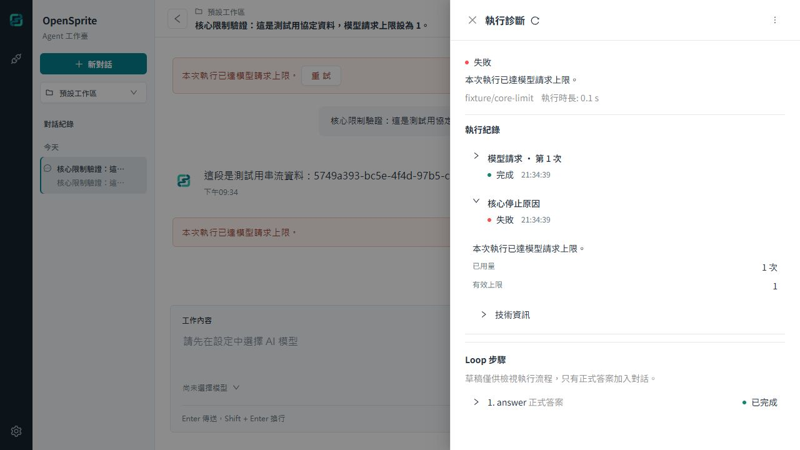
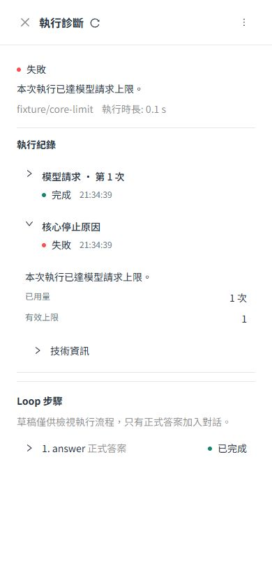

# 核心故障、取消競爭與最終驗證

- 版本：`0.21.38` → `0.21.39`。
- 唯一目標：完成已核准的核心執行強化，驗證取消競爭、交易失敗、實際程序中止與既有 v5 wheel。
- 分支：`codex/core-runtime-hardening`。
- 日期：2026-10-09（Asia/Taipei）。

## 實作

SQLite 在失敗交易內核對已提交的取消狀態。取消若先提交，最後保存的是 `cancelled` 與唯一的 `run.cancelled` 事件，錯誤與限制證據不會殘留。Executor 清理時保留已提交的 completed／failed／cancelled／interrupted；完成交易後通知失敗不會再新增失敗事件或重送模型。

`test_core_runtime_faults.py` 使用實際 SQLite，覆蓋取消與一般錯誤／限制錯誤的競爭、完成後例外、偽造的五種核心限制、終止事件交易回滾，以及重複清理。`scripts/core_runtime_fault_fixture.py` 與 `scripts/verify_core_runtime_faults.py` 是儲存庫驗證程式，沒有新增產品 CLI。控制器只建立唯一命名的隔離容器／卷，留下證據並停止自己建立的容器。

瀏覽器檢查找到巢狀錯誤與 limit 在技術資訊中顯示 `[object Object]`，已改用既有 JSON 換行樣式。既有診斷回歸測試核對完整物件內容。架構說明同步取消與故障邊界，作者来源 ZIP 仍為 9 檔，更新至 58,622 bytes，SHA-256：`f2da87134f987c4ea7f7065e1c4879716400f07c996f29bf987c5e9a47a9d4fd`。

## 最終回歸與安裝

| 驗證 | 結果 |
| --- | --- |
| Docker 完整後端，`pytest -W error` | **1041 passed** |
| 核心故障／SQLite／SDK 聚焦回歸 | **41 passed** |
| 最後診斷修正的前端聚焦回歸 | **18 passed** |
| 最後診斷修正的 Docker 完整前端 | **52 files、482 passed** |
| TypeScript、正式前端建置、compileall、lockfile、pip check | 通過 |
| Windows PowerShell 5.1 隔離安裝檢查 | 通過，產品 0.21.39，官方 v5 wheel 0.2.0 |
| 非 root Linux UID 10002 隔離安裝檢查 | 通過，含空白路徑、access helper 與 systemd unit 檢查 |
| npm audit，正式相依套件（omit dev） | 當次報告 0 項；不代表安全稽核完成 |

Windows 使用儲存庫 Node 24／uv 執行 `installers/windows/test.ps1`，只對該程序設定 ExecutionPolicy Bypass。Linux 使用 Docker 測試映像、Node 22／Python 3.12.15 與 systemd-analyze 執行 `uv run --project backend --frozen bash installers/linux/test.sh`。兩者均未更改真正使用者的安裝或服務。Linux 此次核對隔離安裝及服務檔，未啟動真正 systemd 使用者服務的完整生命週期。前端仍有既有 act／jsdom 與 bundle 大小警告，沒有測試失敗。

## 實際容器中止

執行 `scripts/verify_core_runtime_faults.py`，以實際 Host／SQLite 和帶可變 UUID 的協定 gateway，將正在執行的 UID 10001 容器送出 SIGKILL，核對 exit 137，再用真正的 Uvicorn runtime 啟動同一隔離卷；第二次重啟比較完整保存狀態。這些是實際程序故障測試，模型內容使用明確標記的協定資料。

| 中止位置 | 已確認結果 |
| --- | --- |
| 正式答案串流 | committed prefix 保留；未 flush 尾端未承諾；Run／step interrupted |
| 私有草稿串流 | 私有 prefix 保留；沒有 public assistant.delta；Run／step interrupted |
| 摘要 insert 後、完成事件與 COMMIT 前 | 未完成摘要交易回滾；原對話與已完成 step 保留 |
| 正式答案交易寫入後、完成事件與 COMMIT 前 | assistant message／completed 狀態回滾；先前 committed prefix 保留 |

每案均只有一筆 `run.interrupted`，第二次重啟完全相同，不自動重送模型。當次故障映像：`sha256:f499fe193a9aea4404fc773c44841d07f88a162dd95c4e298007bef9e46b55da`。完整本機 before／after 證據位於 `tmp/core-runtime-proof/faults-25d6ae385f/`，含四案與 result.json。後續修改只涉及前端診斷／作者說明，不更動此已驗證的執行程式碼。

重新驗證範例 wheel 時沒有重建它：`opensprite_execution_example-0.5.0-py3-none-any.whl` 原始 SHA-256 仍為 `e75ed2849b131bf3c051885e6d68a290856a168b662d9a7c7df60b01b0c9b4b3`。在產品 0.21.39 的離線隔離安裝中，真 Host／SQLite／Native Provider adapter 完成可變 UUID 的 draft、review、final 三次協定請求與取消保存。

## Docker 與畫面

本次獨立測試服務：`http://localhost:18771/`，project `opensprite-core-runtime-proof`、專用卷 `opensprite-core-runtime-proof-data`。原始 wheel 经 HTTP 匯入時仍是 not_installed；下載的五檔部署包核對 wheel bytes，另用專用映像標籤建置，重啟後回報 package confirmed、manifest verified，standard／no_recovery／example_review 均可用。未覆寫先前服務的插件映像標籤。

最終映像 `opensprite:core-runtime-with-example`：`sha256:5596a97e5eb9f4837786898c6aab87021b756756124ed1628b9409a0810ce8f6`；執行 UID 10001，API 版本回報 0.21.39。這是提交前建置的開發測試映像，app-info revision 仍為 development。實際重啟後，比對插件確認、選擇、Run／steps／事件完全相同，來源 ZIP 與儲存庫的 9 檔內容逐一相符。證據為 `tmp/core-http-proof/import.json` 與 `tmp/core-runtime-proof/restart-state.json`。

瀏覽器以真 Host 產生的協定案例（模型請求上限設為 1）檢查 1280×720、768×1024、390×844。診斷顯示「已用量 1 次／有效上限 1」，巢狀 JSON 可讀且換行；桌面、平板、手機皆無水平溢出。Escape 關閉診斷回到入口，手機執行抽屜動畫完成後焦點回到頂端操作。最終頁面沒有 console error。

正式服務 `opensprite-opensprite-1` 的映像仍為 `sha256:66fdeae348eca9aa49ca2f076be77dfa598f3d07ebb7f8b71e4a55cf07c6b99d`，健康正常；本階段沒有合併 main 或替換正式服務。

## 尚未完成與邊界

此節記錄 0.21.39 提交時的狀態。使用者後續已明確授權真實測試；授權後的複製、模型成功與重啟證據見 [0.21.40 真實模型驗證紀錄](0324-core-runtime-real-model-verification.md)。

本次尚未執行真實 OpenRouter auto 請求。自動核准審查拒絕把既有測試卷的 auth.json／credential.key 與供應商狀態複製到新的持久測試卷，理由是會新增一份可解密憑證的保存位置，需要使用者明確授權；已提出精確授權問題，目前待回答。該複製未執行，新測試卷不存在 auth.json 或 credential.key。本紀錄不把協定 gateway、假資料、匯入成功或故障測試當作付費模型成功。

保留原核心硬限制與 Loop 決策邊界，公開 API v5 不變。期限及取消仍要求可信 in-process Python 配合 await，不能阻止阻塞主程序的任意 Python；沒有新程序沙箱。不承諾尚未 flush 的字元或主機斷電 durability。後續可獨立規劃 Loop 行為品質評測、建置版本追溯，以及真正需要不可信插件時的程序隔離。
