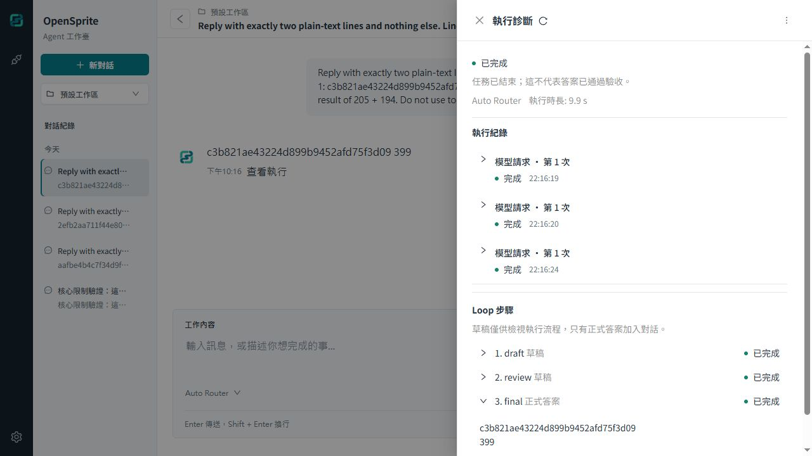

# 核心強化的真實模型驗證與交付

- 版本：`0.21.39` → `0.21.40`。
- 唯一目標：補齊已核准核心強化目標的 OpenRouter 真實請求、重啟與既有 wheel 驗證證據。
- 分支：`codex/core-runtime-hardening`。
- 日期：2026-10-09（Asia/Taipei）。

## 授權與隔離環境

使用者明確確認可以執行真實測試後，停止本階段測試後端，以 UID 10001、停用網路的臨時容器，將 `opensprite-host-loop-v5-proof-data` 的加密 `auth.json`、配對 `config/credential.key` 及供應商狀態，複製到 `opensprite-core-runtime-proof-data`。來源卷唯讀，目標檔案使用 0600，複製時沒有解密或輸出原始憑證；加密資料與解密金鑰一起保留。這兩個測試卷均視為敏感使用者資料，不納入 Git，也沒有刪除或更改來源。

真實請求經由 `http://127.0.0.1:18771/` 的產品 HTTP API、實際 Host、SQLite、NativeModelGateway 與內建 OpenRouter HTTPS adapter 執行，請求模型為 `openrouter/auto`。沒有以協定 gateway 代替此次模型回應。

## 真實模型結果

每案建立新的隨機 nonce，從 nonce 計算不同的加法運算元，要求模型只回答 nonce 與運算結果兩行。以完整兩行相等比對答案，驗證資料沒有把固定答案塞入 gateway。

| Loop | 保存的插件版本 | 真實模型請求 | 運算答案 | Run ID | 結果 |
| --- | --- | ---: | ---: | --- | --- |
| standard | 0.2.0／API v5 | 1 | 441 | `9790c675-5c01-4247-9768-45a5712a5099` | completed，兩行完整相符 |
| no_recovery | 0.2.0／API v5 | 1 | 317 | `dc9a4ba0-3b28-4f4c-b0a3-91793ed8da11` | completed，兩行完整相符 |
| example_review | 原始 wheel 0.5.0／API v5 | 3 | 399 | `1e34bbd4-0ebe-4f8f-8404-e2c8ee90e630` | draft、review、final 全部 completed |

共 3 個 Run、5 次真實模型請求。核對 `execution.selected` 保存的 API／插件版本、模型 attempt 的開始與完成、唯一 completed 終止事件、SSE 的 step／Run 事件，以及實際模型用量。範例 Loop 的 draft 與 review 保存在私有步驟中；對話訊息只有使用者輸入與 final 正式答案。

測試後切回 standard，再以三案原本的 `clientRequestId` 重送：均返回原 Run，沒有新增模型 attempt 或事件。更新容器至 0.21.40 後，再比較完整 Run、steps、events、messages，與更新前完全相同；重啟後重送仍不增加模型請求。

[可審查的實測證據](0324-core-runtime-real-model-evidence.json)包含實際 Run／conversation ID、可變答案、時間、用量、執行 profile、步驟文字 SHA-256 與檢查結果，不包含憑證或私有草稿正文。完整本機 HTTP 紀錄位於忽略的 `tmp/core-http-proof/real-model.json`，重啟比對位於 `tmp/core-runtime-proof/real-restart-state.json`。

## 版本、wheel 與部署核對

付費模型執行時為 0.21.39，映像 `sha256:5596a97e5eb9f4837786898c6aab87021b756756124ed1628b9409a0810ce8f6`。本次新增驗證紀錄並依儲存庫規則遞增至 0.21.40，同步 pyproject、uv.lock 與 README，沒有更動應用程式執行邏輯。容器內 backend 與標準 Loop 的 126 個 Python 原始碼檔案，更新前後 SHA-256 全部一致。

| 本次 0.21.40 檢查 | 結果 |
| --- | --- |
| app-info／build-info／固定 SDK v5 契約回歸 | 15 passed，`pytest -W error` |
| `uv lock --check --offline`、`uv pip check` | 通過 |
| 原始 0.5.0 wheel 離線隔離安裝 | 通過，真 Host／SQLite 的三步驟協定及取消保存通過 |
| 正式 Docker runtime 與 wheel bundle 建置 | 通過，鎖定相依套件及安裝確認正常 |
| 容器更新、healthz、API 版本、插件確認 | 通過，0.21.40、UID 10001、三個插件可用 |
| 三案資料重啟與冪等重送 | 完整狀態相同，沒有新模型請求 |
| 瀏覽器結果及 console error | 正式答案、三個步驟與模型設定正確；沒有 console error |

範例 wheel 沒有重建，SHA-256 仍為 `e75ed2849b131bf3c051885e6d68a290856a168b662d9a7c7df60b01b0c9b4b3`。作者來源 ZIP 的 9 檔及 SHA-256 `f2da87134f987c4ea7f7065e1c4879716400f07c996f29bf987c5e9a47a9d4fd` 亦未更動。

[上一階段的完整回歸與故障紀錄](0323-core-runtime-fault-verification.md)包含後端 1041 passed、前端 482 passed／52 files、typecheck／build、Windows 與非 root Linux 隔離安裝，以及四種真實 SIGKILL／SQLite 交易故障。本次只增加驗證紀錄與版本資訊；這些完整回歸是 0.21.39 的實測結果，沒有宣稱全部在 0.21.40 重新執行。

交付測試映像 `opensprite:core-runtime-with-example`：`sha256:701d44e737ea9360f0c4f7e62a35dee82c41b066c28d546adb9570be7661cf14`。獨立 Compose project `opensprite-core-runtime-proof` 使用專用卷與 `127.0.0.1:18771`。此映像在提交前建置，app-info revision 為 development；以實際映像 SHA 與原始碼指紋記錄來源。

沒有合併 main，沒有替換或重啟 8765 的正式服務；正式映像仍為 `sha256:66fdeae348eca9aa49ca2f076be77dfa598f3d07ebb7f8b71e4a55cf07c6b99d`。

## 邊界與後續方向

此驗證確認真實模型傳輸、Host 與插件整合、草稿分流、資料保存及重送行為，不能代表 Loop 在複雜任務的品質、長時間可靠性或費用表現。記錄的是請求的 `openrouter/auto`，沒有推測 Auto 實際路由的底層模型或帳單金額。

核心硬限制、可信 in-process Python／合作式 await 與 API v5 邊界維持既有設計。四種程序中止測試不等同主機斷電 durability；Linux 安裝器檢查不等同真正 systemd 使用者服務完整生命週期。後續可分別建立 Loop 任務品質評測、補足映像 Git revision 追溯；需要執行不可信插件時，再規劃程序隔離。
