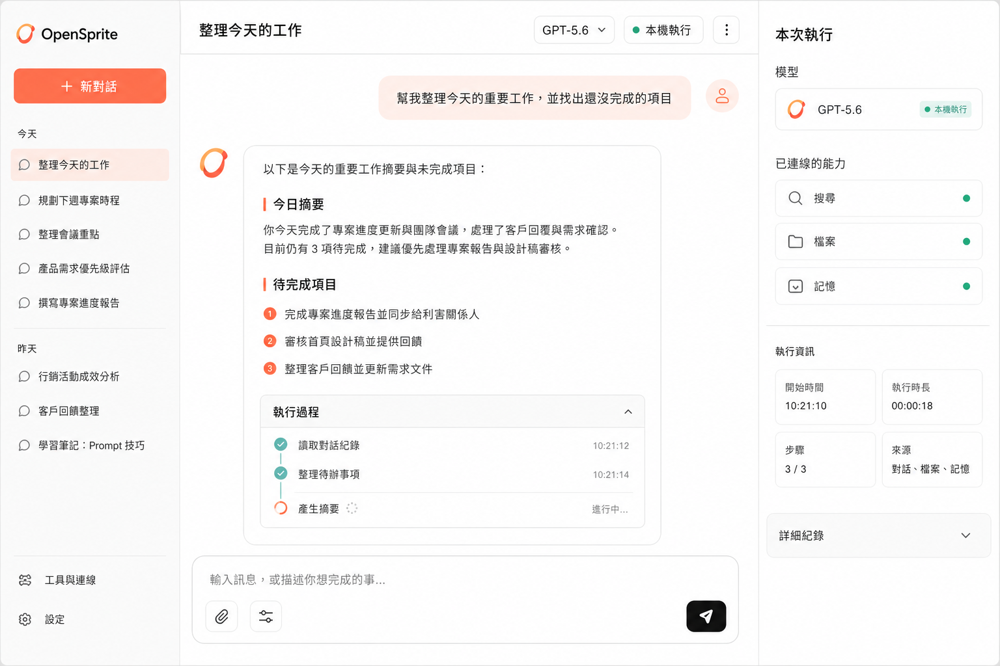
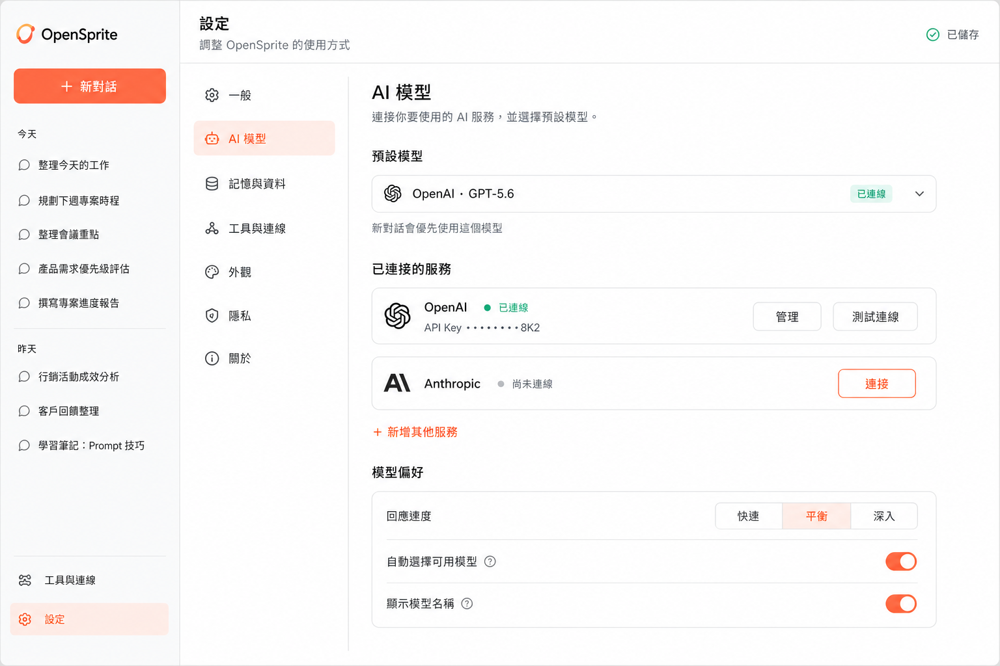
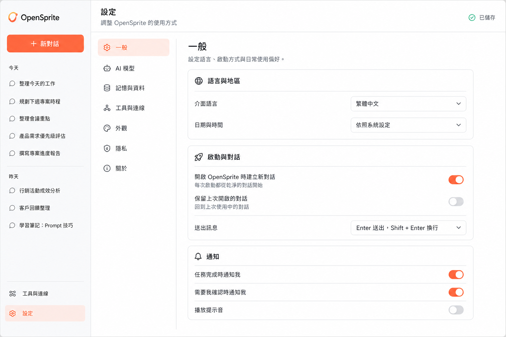

# Frontend concepts

這份文件記錄 OpenSprite 重建期間已產出的前端畫面概念。概念圖用來確認資訊架構與視覺方向，不代表畫面已實作，也不定義後端契約；目前實際能力與契約以 `docs/architecture/`、`README.md` 及 source 為準。

## 共用視覺方向

- 以明亮、安靜、容易理解的桌面工作介面為主。
- 使用暖白背景、白色內容面、深灰文字、珊瑚橘主色與青綠狀態色。
- 固定左側主導覽，讓新對話、歷史對話、工具連線與設定維持一致位置。
- 使用清楚的區塊、細邊框與適量留白，不呈現終端機或工程控制台風格。
- 元件應可用 React 與 Ant Design 實作，但概念圖不限制最終元件細節。

## 01 - AI 對話工作台

主要責任：

- 左側提供新對話、歷史對話、工具連線與設定入口。
- 中央保留給對話、回答、待辦摘要與可折疊的執行過程。
- 右側只顯示本次執行使用的模型、能力與簡要狀態。
- 輸入框是畫面的主要操作入口，技術細節不得搶走對話焦點。

## 02 - AI 模型設定

主要責任：

- 保留與對話工作台一致的主導覽與視覺語言。
- 一般與 AI 模型是可操作分類；其他規劃分類以停用的 Demo 項目呈現。
- AI 模型頁管理預設模型、服務連線狀態與少量容易理解的使用偏好。
- 金鑰只顯示遮蔽結果，不在概念圖中定義儲存方式或後端行為。

## 03 - 一般設定

主要責任：

- 管理介面語言與時區。
- 語言、時區、啟動、訊息按鍵、自動捲動與執行面板設定已由目前的 General／Conversation Settings 實作；通知仍以不可操作的「未來上線」資訊列呈現。
- 不包含模型、記憶資料、工具、外觀或隱私設定，避免分類重疊。

## 概念稿當時尚未決定（歷史紀錄）

以下項目保留作為概念稿當時的決策狀態；已實作的手機導覽、設定欄位、HTTP／SSE、憑證與模型清單行為，請以目前架構文件與測試為準。

- 實際 Logo、字體、圖示來源與最終 design tokens。
